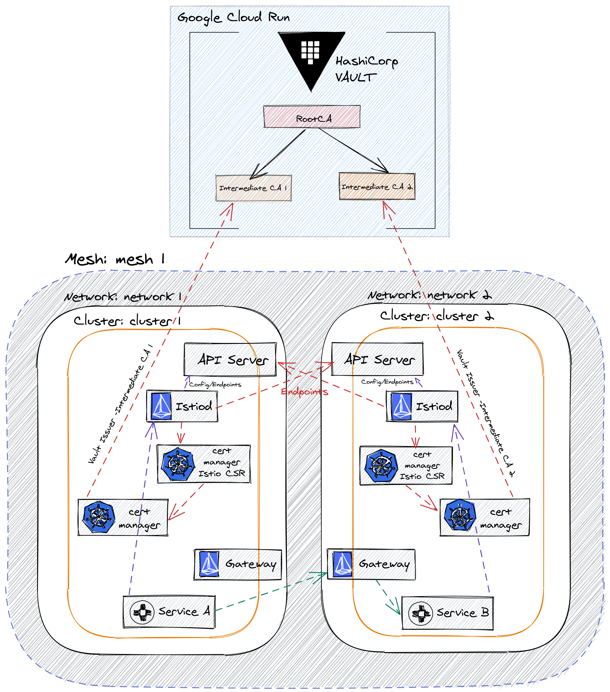

# Multicluster Istio1.9 and Hashicorp Vault CA Integration

## Introduction

This tutorial shows you a full end-to-end example on how to integrate a Vault Certificate Authority (CA) with a multicluster Istio, which can be used in order to issue certificates for workloads in the mesh.


## Implementation Architecture

In this tutorial, we will build the following architecture:



## Prerequisites


- A GCP project with billing enabled
- gcloud CLI
- kubectl

<br/>

## Set project variables

``` bash
❯ export PROJECT_ID=<your-project-id>
```

<br/>


# Setup

## 1) [Create Hashicorp Vault Cluster](https://github.com/kelseyhightower/serverless-vault-with-cloud-run#tutorial)


## 2) Create GKE Clusters


```bash
my@localhost:~$./1-create-gke-clusters.sh
```


## 3) [Connect GKE clusters with External Vault](k8s-external-vault.md)

## 4) [Configure Vault PKI secrets engine](https://gist.github.com/palimarium/3a0c7a1026f0789f7ce1d7f2689665f9)

## 5) [Deploy Cert Manager](cert-manager-setup.md) 

## 6) [Install Cert Manager istio-csr](istio-csr-setup.md)

## 7) [Multicluster Istio installation](https://istio.io/latest/docs/setup/install/multicluster/multi-primary_multi-network/)

* skip the how to's sections:  `Configure cluster1/cluster2 as a primary`

* **Install the east-west gateway in cluster1/cluster2**, we need to update the script `samples/multicluster/gen-eastwest-gateway.sh`,  in order to change certificate provider to cert-manager istio agent for istio agent:

```bash
values:
    global:
      # Change certificate provider to cert-manager istio agent for istio agent
      caAddress: cert-manager-istio-csr.cert-manager.svc:443
      meshID: ${MESH}
      network: ${NETWORK}

```

```bash
$ resources/gen-eastwest-gateway.sh \
    --mesh mesh1 --cluster cluster1 --network network1 | \
    istioctl --context="${CTX_CLUSTER1}" install -y -f -

$ resources/gen-eastwest-gateway.sh \
    --mesh mesh1 --cluster cluster2 --network network2 | \
    istioctl --context="${CTX_CLUSTER2}" install -y -f -    

```


## 8) [Deploy the HelloWorld application](https://istio.io/latest/docs/setup/install/multicluster/verify/)

## 9) Verifying Cross-Cluster Traffic & Workload Certificates

``` bash

❯ kubectl exec --context="${CTX_CLUSTER2}" -n sample -c sleep \
    "$(kubectl get pod --context="${CTX_CLUSTER2}" -n sample -l \
    app=sleep -o jsonpath='{.items[0].metadata.name}')" \
    -- curl -sS helloworld.sample:5000/hello


Hello version: v1, instance: helloworld-v1-5b75657f75-dqgzs

Hello version: v2, instance: helloworld-v2-7855866d4f-mk5zp
```

```bash

$ kubectl get cm istio-ca-root-cert -o jsonpath="{.data['root-cert\.pem']}" | step certificate inspect -
Certificate:
    Data:
        Version: 3 (0x2)
        Serial Number: 634565633720850014245369823118779079328248785051 (0x6f26e83a297cc63f7be562d409add0c5e996689b)
    Signature Algorithm: SHA256-RSA
        Issuer: CN=istio-ca
        Validity
            Not Before: Mar 9 15:02:52 2021 UTC
            Not After : Mar 7 15:03:22 2031 UTC
        Subject: CN=istio-ca
        Subject Public Key Info:
            Public Key Algorithm: RSA
                Public-Key: (2048 bit)
                Modulus:


$ istioctl proxy-config secret sleep-64d7d56698-lfc9z -n sample -o json | \
jq '.dynamicActiveSecrets[0].secret.tlsCertificate.certificateChain.inlineBytes' | \
sed 's/"//g' | base64 --decode | openssl x509 -noout -text
Certificate:
    Data:
        Version: 3 (0x2)
        Serial Number:
            72:3f:1f:8a:58:67:2a:bb:80:e6:f4:9e:d5:2d:13:03:b3:59:49:93
        Signature Algorithm: sha256WithRSAEncryption
        Issuer: CN = Istio-ca Intermediate Authority1
        Validity
            Not Before: Mar  9 20:47:38 2021 GMT
            Not After : Mar 10 20:48:08 2021 GMT
        Subject: 
        Subject Public Key Info:
            Public Key Algorithm: rsaEncryption
                RSA Public-Key: (2048 bit)
                Modulus:
                    00:b4:b5:ec:e6:85:69:9e:4d:da:20:98:1d:ea:33:
                    39:89:69:24:c9:0d:2e:0a:18:80:6e:e4:0f:d6:8b:
                    d5:16:ef:75:b9:5a:44:9a:12:f6:7a:7d:52:7b:27:
                    7c:e3:3d:d5:3f:61:37:ee:43:78:b6:5f:5b:07:68:
                    f4:a5:83:68:65:ee:38:97:9e:20:4e:d2:79:32:64:
                    8c:95:42:25:f3:b7:23:5e:6c:64:f2:88:3b:b0:c4:
                    81:4c:79:6c:93:19:79:d8:35:ba:06:0f:a1:5e:e3:
                    56:b3:08:3e:4b:f8:51:26:65:15:e6:59:20:e9:15:
                    c8:b5:9c:ea:c2:84:65:04:4c:1b:3a:89:58:75:b9:
                    34:db:e7:cc:bc:58:ba:b7:8a:7c:4d:1a:59:eb:d8:
                    f7:a8:84:7e:f1:8e:fa:ca:84:cd:f4:a9:2f:d8:9e:
                    97:8c:61:54:e3:71:b9:7f:18:3a:3c:03:4f:55:c9:
                    64:bf:7b:52:d5:47:33:00:5a:aa:b1:51:81:80:51:
                    69:e5:8e:3e:9b:71:a3:e4:bc:bc:66:99:4b:88:dc:
                    8d:90:4b:a6:8c:3d:e9:69:d2:ba:6a:63:51:30:ce:
                    2b:24:71:7d:70:aa:25:ee:bf:5d:b3:8f:8e:49:b7:
                    b9:c7:21:7c:e2:4d:64:82:f5:37:e8:f0:ef:c2:4c:
                    1d:d3
                Exponent: 65537 (0x10001)
        X509v3 extensions:
            X509v3 Key Usage: critical
                Digital Signature, Key Encipherment, Key Agreement
            X509v3 Extended Key Usage: 
                TLS Web Server Authentication, TLS Web Client Authentication
            X509v3 Subject Key Identifier: 
                CD:92:C2:8E:B2:43:CB:21:44:7C:25:DB:91:52:F4:0B:F2:D6:43:F2
            X509v3 Authority Key Identifier: 
                keyid:60:F0:BF:BD:D9:4A:AB:4A:96:01:FD:67:82:74:64:A2:35:B4:BB:57

            X509v3 Subject Alternative Name: critical
                URI:spiffe://cluster.local/ns/sample/sa/sleep


$ istioctl proxy-config secret sleep-64d7d56698-tb5gh -n sample -o json | \
jq '.dynamicActiveSecrets[0].secret.tlsCertificate.certificateChain.inlineBytes' | \
sed 's/"//g' | base64 --decode | openssl x509 -noout -text

Certificate:
    Data:
        Version: 3 (0x2)
        Serial Number:
            54:14:82:4b:40:1e:4e:a1:d2:59:8f:65:9b:19:0e:a4:6f:de:42:e4
        Signature Algorithm: sha256WithRSAEncryption
        Issuer: CN = Istio-ca Intermediate Authority2
        Validity
            Not Before: Mar  9 20:47:38 2021 GMT
            Not After : Mar 10 20:48:08 2021 GMT
        Subject: 
        Subject Public Key Info:
            Public Key Algorithm: rsaEncryption

                Exponent: 65537 (0x10001)
        X509v3 extensions:
            X509v3 Key Usage: critical
                Digital Signature, Key Encipherment, Key Agreement
            X509v3 Extended Key Usage: 
                TLS Web Server Authentication, TLS Web Client Authentication
            X509v3 Subject Key Identifier: 
                4D:FA:40:E7:BC:68:D2:F3:71:A7:6D:68:A1:53:D9:74:0D:02:D9:F2
            X509v3 Authority Key Identifier: 
                keyid:F4:CD:09:38:E2:C2:2E:12:7A:A0:76:CB:F8:54:BB:D3:CE:E6:B5:4B

            X509v3 Subject Alternative Name: critical
                URI:spiffe://cluster.local/ns/sample/sa/sleep
    Signature Algorithm: sha256WithRSAEncryption
```

## 10) Check the endpoints discovered by the Istio control plane 

``` bash

❯ kubectl --namespace=istio-system exec -c discovery $(kubectl --namespace=istio-system get pods --no-headers -l app=istiod | awk '{print $1}') -- curl --max-time 10 -s http://127.0.0.1:8080/debug/endpointShardz

{
  "cert-manager-istio-csr.cert-manager.svc.cluster.local": {
   "cert-manager": {
    "Shards": {
     "cluster1": [
      {
       "Labels": {
        "app": "cert-manager-istio-csr",
        "pod-template-hash": "6d4f56c5fb",
        "topology.istio.io/cluster": "cluster1",
        "topology.kubernetes.io/region": "europe-west2",
        "topology.kubernetes.io/zone": "europe-west2-a"
       },
       "Address": "10.100.2.7",
       "ServicePortName": "web",
       "EnvoyEndpoint": {
        "HostIdentifier": {
         "Endpoint": {
          "address": {
           "Address": {
            "SocketAddress": {
             "address": "10.100.2.7",
             "PortSpecifier": {
              "PortValue": 6443
             }
            }
           }
          }
         }
        },
        "metadata": {
         "filter_metadata": {
          "envoy.transport_socket_match": {
           "tlsMode": "disabled"
          },
          "istio": {
           "network": "network1",
           "workload": "cert-manager-istio-csr;cert-manager;;"
          }
         }
        },
        "load_balancing_weight": {
         "value": 1
        }
       },
       "ServiceAccount": "spiffe://cluster.local/ns/cert-manager/sa/cert-manager-istio-csr",
       "Network": "network1",
       "Locality": {
        "Label": "europe-west2/europe-west2-a/",
        "ClusterID": "cluster1"
       },
       "EndpointPort": 6443,
       "LbWeight": 0,
       "TLSMode": "disabled",
       "Namespace": "cert-manager",
       "WorkloadName": "cert-manager-istio-csr",
       "TunnelAbility": 0
      }
     ],
     "cluster2": [
      {
       "Labels": {
        "app": "cert-manager-istio-csr",
        "pod-template-hash": "559b8786b5",
        "topology.istio.io/cluster": "cluster2",
        "topology.kubernetes.io/region": "us-central1",
        "topology.kubernetes.io/zone": "us-central1-a"
       },
       "Address": "10.104.0.14",
       "ServicePortName": "web",
       "EnvoyEndpoint": {
        "HostIdentifier": {
         "Endpoint": {
          "address": {
           "Address": {
            "SocketAddress": {
             "address": "10.104.0.14",
             "PortSpecifier": {
              "PortValue": 6443
             }
            }
           }
          }
         }
        },
        "metadata": {
         "filter_metadata": {
          "envoy.transport_socket_match": {
           "tlsMode": "disabled"
          },
          "istio": {
           "network": "network2",
           "workload": "cert-manager-istio-csr;cert-manager;;"
          }
         }
        },
        "load_balancing_weight": {
         "value": 1
        }
       },
       "ServiceAccount": "spiffe://cluster.local/ns/cert-manager/sa/cert-manager-istio-csr",
       "Network": "network2",
       "Locality": {
        "Label": "us-central1/us-central1-a/",
        "ClusterID": "cluster2"
       },
       "EndpointPort": 6443,
       "LbWeight": 0,
       "TLSMode": "disabled",
       "Namespace": "cert-manager",
       "WorkloadName": "cert-manager-istio-csr",
       "TunnelAbility": 0
      }
     ]
    },
    "ServiceAccounts": {
     "spiffe://cluster.local/ns/cert-manager/sa/cert-manager-istio-csr": {}
    }
   }
  },
  "cert-manager-webhook.cert-manager.svc.cluster.local": {
   "cert-manager": {
    "Shards": {
     "cluster1": [
      {
       "Labels": {
        "app": "webhook",
        "app.kubernetes.io/component": "webhook",
        "app.kubernetes.io/instance": "cert-manager",
        "app.kubernetes.io/managed-by": "Helm",
        "app.kubernetes.io/name": "webhook",
        "helm.sh/chart": "cert-manager-v1.2.0",
        "pod-template-hash": "5f59d4c7bd",
        "topology.istio.io/cluster": "cluster1",
        "topology.kubernetes.io/region": "europe-west2",
        "topology.kubernetes.io/zone": "europe-west2-a"
       },
       "Address": "10.100.0.6",
       "ServicePortName": "https",
       "EnvoyEndpoint": {
        "HostIdentifier": {
         "Endpoint": {
          "address": {
           "Address": {
            "SocketAddress": {
             "address": "10.100.0.6",
             "PortSpecifier": {
              "PortValue": 10250
             }
            }
           }
          }
         }
        },
        "metadata": {
         "filter_metadata": {
          "envoy.transport_socket_match": {
           "tlsMode": "disabled"
          },
          "istio": {
           "network": "network1",
           "workload": "cert-manager-webhook;cert-manager;;"
          }
         }
        },
        "load_balancing_weight": {
         "value": 1
        }
       },
       "ServiceAccount": "spiffe://cluster.local/ns/cert-manager/sa/cert-manager-webhook",
       "Network": "network1",
       "Locality": {
        "Label": "europe-west2/europe-west2-a/",
        "ClusterID": "cluster1"
       },
       "EndpointPort": 10250,
       "LbWeight": 0,
       "TLSMode": "disabled",
       "Namespace": "cert-manager",
       "WorkloadName": "cert-manager-webhook",
       "TunnelAbility": 0
      }
     ],
     "cluster2": [
      {
       "Labels": {
        "app": "webhook",
        "app.kubernetes.io/component": "webhook",
        "app.kubernetes.io/instance": "cert-manager",
        "app.kubernetes.io/managed-by": "Helm",
        "app.kubernetes.io/name": "webhook",
        "helm.sh/chart": "cert-manager-v1.2.0",
        "pod-template-hash": "5f59d4c7bd",
        "topology.istio.io/cluster": "cluster2",
        "topology.kubernetes.io/region": "us-central1",
        "topology.kubernetes.io/zone": "us-central1-a"
       },
       "Address": "10.104.1.3",
       "ServicePortName": "https",
       "EnvoyEndpoint": {
        "HostIdentifier": {
         "Endpoint": {
          "address": {
           "Address": {
            "SocketAddress": {
             "address": "10.104.1.3",
             "PortSpecifier": {
              "PortValue": 10250
             }
            }
           }
          }
         }
        },
        "metadata": {
         "filter_metadata": {
          "envoy.transport_socket_match": {
           "tlsMode": "disabled"
          },
          "istio": {
           "network": "network2",
           "workload": "cert-manager-webhook;cert-manager;;"
          }
         }
        },
        "load_balancing_weight": {
         "value": 1
        }
       },
       "ServiceAccount": "spiffe://cluster.local/ns/cert-manager/sa/cert-manager-webhook",
       "Network": "network2",
       "Locality": {
        "Label": "us-central1/us-central1-a/",
        "ClusterID": "cluster2"
       },
       "EndpointPort": 10250,
       "LbWeight": 0,
       "TLSMode": "disabled",
       "Namespace": "cert-manager",
       "WorkloadName": "cert-manager-webhook",
       "TunnelAbility": 0
      }
     ]
    },
    "ServiceAccounts": {
     "spiffe://cluster.local/ns/cert-manager/sa/cert-manager-webhook": {}
    }
   }
  },
  "cert-manager.cert-manager.svc.cluster.local": {
   "cert-manager": {
    "Shards": {
     "cluster1": [
      {
       "Labels": {
        "app": "cert-manager",
        "app.kubernetes.io/component": "controller",
        "app.kubernetes.io/instance": "cert-manager",
        "app.kubernetes.io/managed-by": "Helm",
        "app.kubernetes.io/name": "cert-manager",
        "helm.sh/chart": "cert-manager-v1.2.0",
        "pod-template-hash": "56f5c44b5d",
        "topology.istio.io/cluster": "cluster1",
        "topology.kubernetes.io/region": "europe-west2",
        "topology.kubernetes.io/zone": "europe-west2-a"
       },
       "Address": "10.100.1.3",
       "ServicePortName": "",
       "EnvoyEndpoint": {
        "HostIdentifier": {
         "Endpoint": {
          "address": {
           "Address": {
            "SocketAddress": {
             "address": "10.100.1.3",
             "PortSpecifier": {
              "PortValue": 9402
             }
            }
           }
          }
         }
        },
        "metadata": {
         "filter_metadata": {
          "envoy.transport_socket_match": {
           "tlsMode": "disabled"
          },
          "istio": {
           "network": "network1",
           "workload": "cert-manager;cert-manager;;"
          }
         }
        },
        "load_balancing_weight": {
         "value": 1
        }
       },
       "ServiceAccount": "spiffe://cluster.local/ns/cert-manager/sa/cert-manager",
       "Network": "network1",
       "Locality": {
        "Label": "europe-west2/europe-west2-a/",
        "ClusterID": "cluster1"
       },
       "EndpointPort": 9402,
       "LbWeight": 0,
       "TLSMode": "disabled",
       "Namespace": "cert-manager",
       "WorkloadName": "cert-manager",
       "TunnelAbility": 0
      }
     ],
     "cluster2": [
      {
       "Labels": {
        "app": "cert-manager",
        "app.kubernetes.io/component": "controller",
        "app.kubernetes.io/instance": "cert-manager",
        "app.kubernetes.io/managed-by": "Helm",
        "app.kubernetes.io/name": "cert-manager",
        "helm.sh/chart": "cert-manager-v1.2.0",
        "pod-template-hash": "56f5c44b5d",
        "topology.istio.io/cluster": "cluster2",
        "topology.kubernetes.io/region": "us-central1",
        "topology.kubernetes.io/zone": "us-central1-a"
       },
       "Address": "10.104.0.8",
       "ServicePortName": "",
       "EnvoyEndpoint": {
        "HostIdentifier": {
         "Endpoint": {
          "address": {
           "Address": {
            "SocketAddress": {
             "address": "10.104.0.8",
             "PortSpecifier": {
              "PortValue": 9402
             }
            }
           }
          }
         }
        },
        "metadata": {
         "filter_metadata": {
          "envoy.transport_socket_match": {
           "tlsMode": "disabled"
          },
          "istio": {
           "network": "network2",
           "workload": "cert-manager;cert-manager;;"
          }
         }
        },
        "load_balancing_weight": {
         "value": 1
        }
       },
       "ServiceAccount": "spiffe://cluster.local/ns/cert-manager/sa/cert-manager",
       "Network": "network2",
       "Locality": {
        "Label": "us-central1/us-central1-a/",
        "ClusterID": "cluster2"
       },
       "EndpointPort": 9402,
       "LbWeight": 0,
       "TLSMode": "disabled",
       "Namespace": "cert-manager",
       "WorkloadName": "cert-manager",
       "TunnelAbility": 0
      }
     ]
    },
    "ServiceAccounts": {
     "spiffe://cluster.local/ns/cert-manager/sa/cert-manager": {}
    }
   }
  },
  "default-http-backend.kube-system.svc.cluster.local": {
   "kube-system": {
    "Shards": {
     "cluster1": [
      {
       "Labels": {
        "k8s-app": "glbc",
        "name": "glbc",
        "pod-template-hash": "7fd66b8b88",
        "topology.istio.io/cluster": "cluster1",
        "topology.kubernetes.io/region": "europe-west2",
        "topology.kubernetes.io/zone": "europe-west2-a"
       },
       "Address": "10.100.2.6",
       "ServicePortName": "http",
       "EnvoyEndpoint": {
        "HostIdentifier": {
         "Endpoint": {
          "address": {
           "Address": {
            "SocketAddress": {
             "address": "10.100.2.6",
             "PortSpecifier": {
              "PortValue": 8080
             }
            }
           }
          }
         }
        },
        "metadata": {
         "filter_metadata": {
          "envoy.transport_socket_match": {
           "tlsMode": "disabled"
          },
          "istio": {
           "network": "network1",
           "workload": "l7-default-backend;kube-system;;"
          }
         }
        },
        "load_balancing_weight": {
         "value": 1
        }
       },
       "ServiceAccount": "spiffe://cluster.local/ns/kube-system/sa/default",
       "Network": "network1",
       "Locality": {
        "Label": "europe-west2/europe-west2-a/",
        "ClusterID": "cluster1"
       },
       "EndpointPort": 8080,
       "LbWeight": 0,
       "TLSMode": "disabled",
       "Namespace": "kube-system",
       "WorkloadName": "l7-default-backend",
       "TunnelAbility": 0
      }
     ],


```
